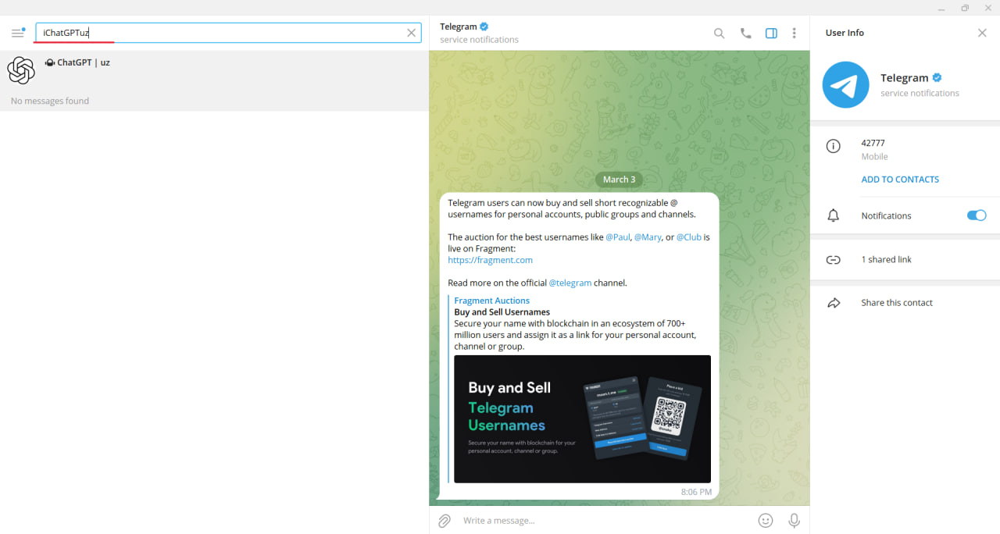
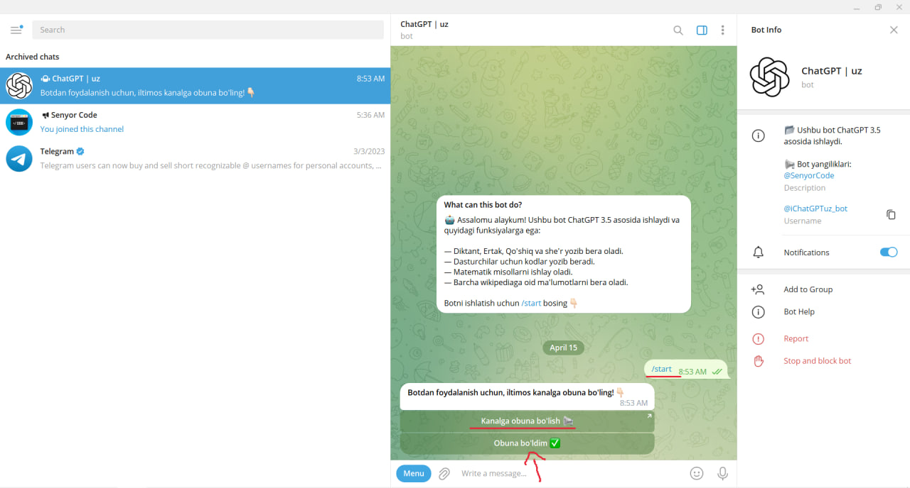
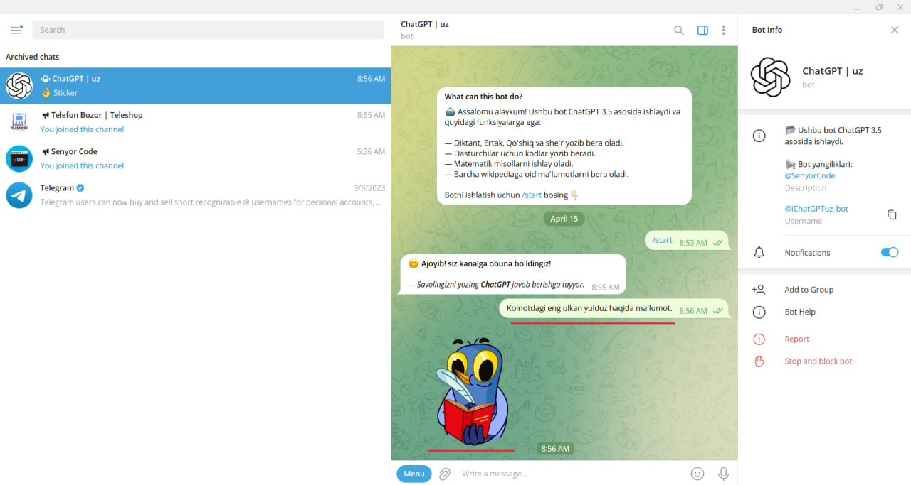
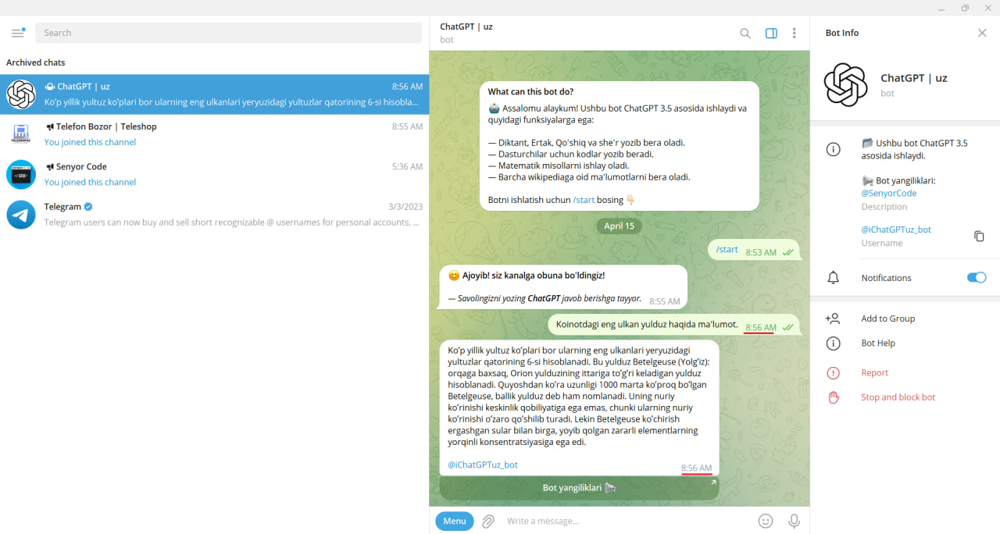

<h1 align="center">iChatGPTuz - Telegram bot</h1>
:warning: <b> - Botni ko'chirib olganingizda uni Manbasini keltirishni unutmang!</b> 
<h3 align="left">Bot qulayliklari:</h3>
<b>1.</b> ChatGPT 3.5 versiyasidagi <b>barcha qulayliklar</b> botda mavjud. :octocat:  
<b>2.</b> Hozirda xar bir user uchun bot javobni tezroq berish ustida ishlamoqdamiz. :zap:  
<b>3.</b> Muammolar bartaraf etilmoqda kamchiliklar tuzatilmoqda. :mag:

<h3 align="left">Botdan Foydalanish:</h3>

<b>1.</b> Telegram orqali <b>ichatgptuz</b> deb qidiring: 

<b>2.</b> Botga kirib <b>/START</b> tugmasini bosing. Va kanalga obuna bo'lishni so'raydi. Obuna bo'lish tugmasini bosing va tasdiqlang! 

<b>3.</b> Savolingizni yozing va quyidagi <b>Stiker</b> chiqadi. Biroz kuting savolingiz darajasiga qarab javob berish vaqti cho'zilishi mumkin.: 

<b> 4.</b>Yuqorida aytib o'tganim kabi savolingiz darajasiga qarab javobni tez beradi. Quyidagi rasmda ko'rsatilgan.: 

<h3 align="left">Kelgusi yangilanishda:</h3>
— Botga <b>"Do'stlarni Taklif Qilish"</b> komandasi qo'shiladi. 
— 5 ta foydalaunchi taklifi uchun botda <b>Premium</b> userga aylanadi. 
— <b>Premium User</b> botdan tez hamda reklama va cheklovlarsiz foydalanadi. 
<i>Yangilanish tez orada botda va kanalda e'lon qilinadi</i> 
 
<i>Savol va takliflar uchun telegram orqali murojat qiling.</i>
